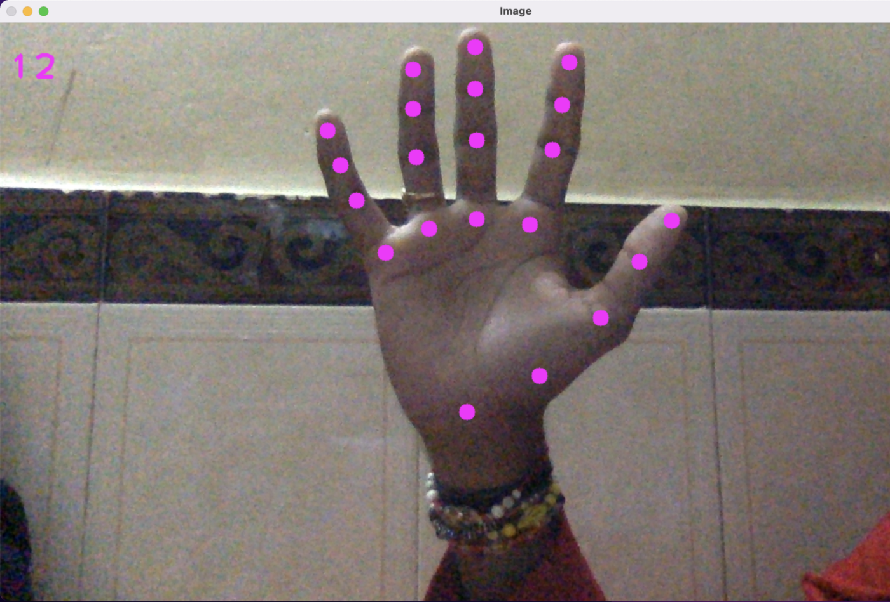

# Project for detection face, hands and body

> More information:
```
python manage.py
```
> Example using CustomDetector:
```python
from main.models import CustomDetector, FaceDetector, HandDetector

# create object detector
detector = CustomDetector(detectors=[
    FaceDetector(),
    HandDetector(),
    ...
])
# cap_name - path to video(0 - webcam)
detector.cap_name = 0
# run loop streem
detector.streem()
```
> For test, run command:
```
python manage.py ./data/2.mp4 --face-mesh --hand
```

